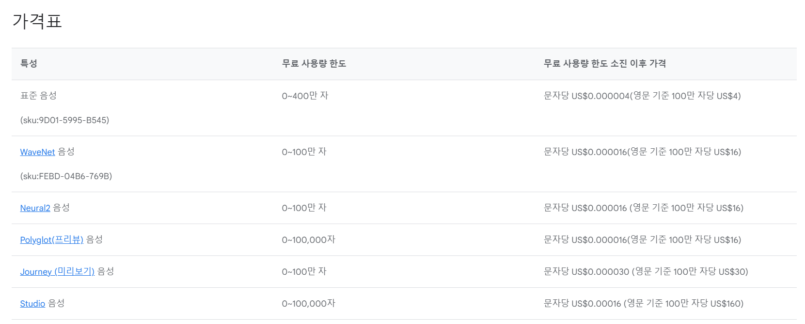
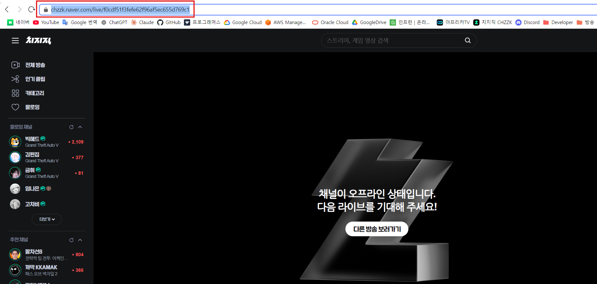
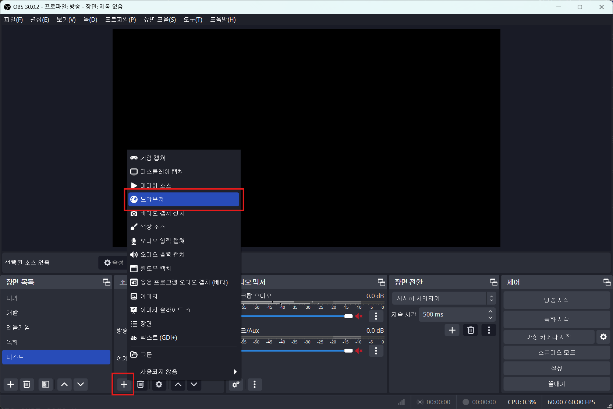
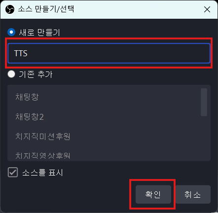
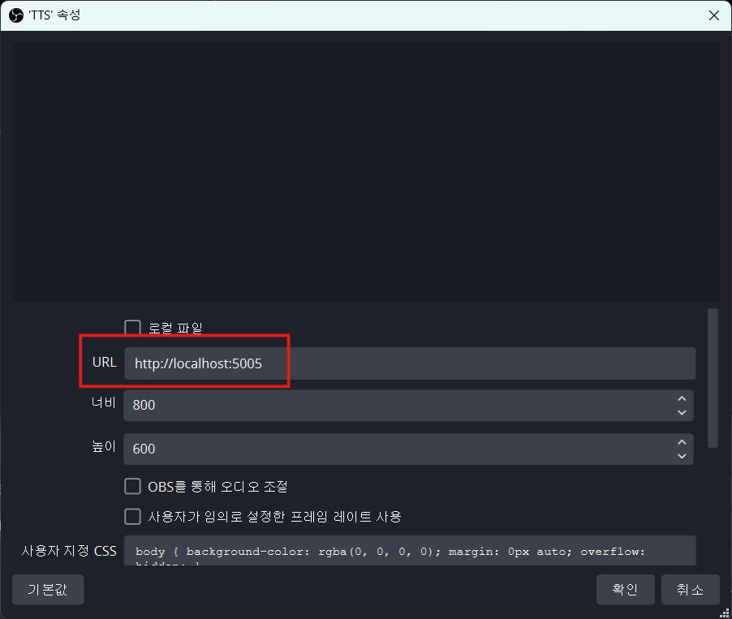

# 치지직 TTS 봇

치지직에서 방송하시는 분들을 위한 소소한 TTS 봇입니다.<br>
구글에서 제공하는 TTS API를 사용하고 있습니다.

# 시작하기 앞서 문제점

1. 웹브라우저 정책상 브라우저에서 자동으로 사운드를 재생하는 것을 금지하고 있습니다. 그렇기에, 번거롭지만 방송을 진행하실 때마다 서버를 실행 후 나오는 웹사이트 주소로 들어가서 흰 화면을 한번 클릭해야 합니다.
2. 구글에서 제공하는 TTS API를 사용하고 있고, 무료사용량이 넉넉하긴 하지만 다 사용하게 될 경우 요금이 청구될 수 있습니다. 무료사용량은 매월 기준입니다. 현재 사용중인 음성은 `Neural2` 입니다.



# 사용방법

1. 오른쪽의 `Releases`에서 파일을 다운로드 합니다.
2. 압축을 해제합니다.
3. 구글 TTS API를 발급 받습니다.
4. `config.json`에 필요한 정보를 입력합니다.
5. `ChzzkBot.exe`를 실행합니다.
6. `localhost:5005` 주소로 접속하여 흰 화면을 마우스로 몇번 클릭합니다.
7. 방송에서 채팅을 몇개 입력하여 소리가 잘 들리는지 확인합니다.

## Google TTS API 발급받기

[문서로 이동하기](GoogleAPI.md)

## config.json 작성하기

```json
{
    "channel_id": "",
    "login": {
        "nid_aut": "",
        "nid_ses": ""
    },
    "google_json": "",
    "tts_option": {
        "gender": "FEMALE",
        "speaking_rate": 1,
        "dynamic_speaking": "true",
        "pitch": 1,
        "max_length": 100
    }
}
```

| json                 | 설명                                                                                                                                                                            |
|----------------------|-------------------------------------------------------------------------------------------------------------------------------------------------------------------------------|
| **channel_id**       | 방송채널 아이디입니다. 치지직 방송화면에서 주소를 보시면 확인할 수 있습니다. `chzzk.naver.com/live/f0cdf51f3fefe62f96af5ec655d769c1`에서 `f0cdf51f3fefe62f96af5ec655d769c1` 부분이 채널아이디입니다.<br> |
| **login**            | 로그인 부분은 `선택사항`입니다. 단순히, 채팅메시지를 TTS로 읽어주는 역할만 하기 때문에 작성하실 필요는 없습니다. 해당 봇을 기반으로 기능을 더 추가하시려면 로그인이 필요합니다.                                                                        |
| **google_json**      | `Google TTS API 발급받기` 문서에서 해당부분이 맨 마지막에 언급됩니다.                                                                                                                                |
| **tts_option**       | TTS 옵션입니다. 성별, 스피드, 피치 등을 설정할 수 있습니다.                                                                                                                                         |
| **gender**           | 성별로 남성은 `MALE`, 여성은 `FEMALE`로 지정합니다.                                                                                                                                          |
| **speaking_rate**    | TTS 재생 속도를 지정합니다. 0.25 ~ 4.00 사이의 값으로 지정해야 합니다.                                                                                                                               |
| **dynamic_speaking** | 채팅 내용이 길수록 더 빠르게 재생하게 할 수 있는 옵션입니다. `true` or `false`로 입력하시면 됩니다. (`false` 옵션 비활성화)                                                                                           |
| **pitch** | TTS의 음높이를 조절할 수 있습니다. -20.00 ~ 20.00 사이의 값으로 지정해야 합니다.                                                                                                                        |
| **max_length** | 채팅메시지가 `max_length`보다 길면 읽어주지 않도록 설정합니다.                                                                                                              |

## 방송 설정하기 (OBS)

1. [소스 목록]에서 [+] 버튼을 누르고 [브라우저]를 선택합니다.

2. 이름을 지정하고 [확인]을 누릅니다.<br>

3. [URL]을 `http://localhost:5005`로 지정하고, TTS 볼륨조절을 위해 `OBS를 통해 오디오 조절`을 체크합니다.

4. 이제 방송을 시작하실 때, `http://localhost:5005`를 브라우저로 한번 접속하여 흰 화면을 마우스로 몇번 클릭하고 진행하시면 됩니다.

# TODO List

1. 마우스 클릭 필요없이 바로 TTS 재생 가능하게 개선하기. 다른 서비스에서는 따로 설정없이 바로 TTS 재생이 되는 걸 봐서는 우회 방법이 있긴 할 것 같네요.
